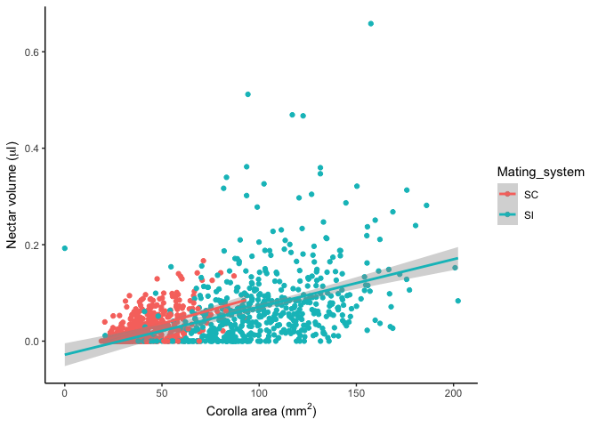
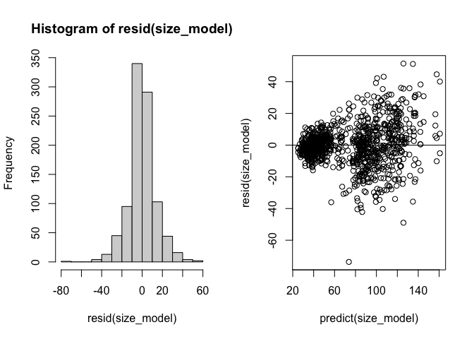
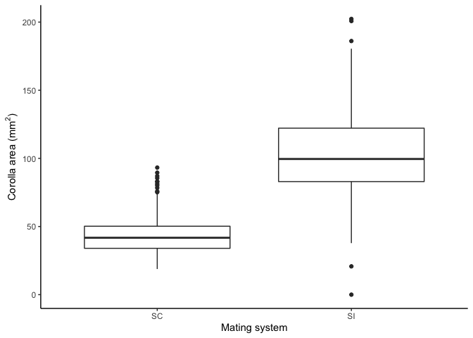
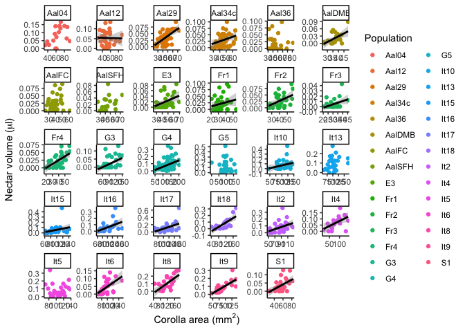

Analyses for honest signals MS
================

## Analyses

Question 1: Is flower size variation consistent between the field and
the greenhouse?

*Approach*: Comparing population means between the field and the
greenhouse. Are we trying to compare each individual population field to
greenhouse (e.g. two sample t-tests), or a trend across the populations
field vs. greenhouse (e.g. regression of population means between field
and greenhouse)?

Question 2: Are size and scent honest signals for nectar rewards?

*Approach*: Correlation between size and rewards, and between scent and
rewards. First do a regression of all plants, with plant nested within
population as a random effect. Then do regressions for each population.

### Packages and start up code:

``` r
library(tidyverse)
library(readxl)
library(lme4)
library(lmerTest)
library(knitr)
library(lmerTest)
library(emmeans)
library(ggpubr)
library(plotrix)
```

### Q1: Is there population differentiation in size in the field and the greenhouse?

*Greenhouse* Loading in the data, filtering out the NAs, and selecting
the populations with 8 or more plants

``` r
nectar <- read_excel("nectar protocol.xlsx")

nectar_work <- nectar %>% filter(!is.na(Population)) %>%  filter(!is.na(nectar_μl)) %>% filter(!is.na(Corola_area_mm2))

nectar_work8 <- nectar_work %>% group_by(Population) %>% filter (length(unique(Plant_id))>=8)
```

Analyzing population differences

``` r
size_mod<- lmer(Corola_area_mm2~Population+(1|Plant_id), data = nectar_work8)

anova(size_mod)
```

    ## Type III Analysis of Variance Table with Satterthwaite's method
    ##            Sum Sq Mean Sq NumDF  DenDF F value    Pr(>F)    
    ## Population 250372  8941.9    28 291.19   37.99 < 2.2e-16 ***
    ## ---
    ## Signif. codes:  0 '***' 0.001 '**' 0.01 '*' 0.05 '.' 0.1 ' ' 1

``` r
#emmeans(size_mod, pairwise~Population)
emms<-emmeans(size_mod, "Population")
#pwpm(emms)
plot(emms, comparisons = TRUE)
```

<!-- -->

*Field*

``` r
field <- read_csv("field_data.csv")
field_work <- field %>% filter(!is.na(FlowerSize))

field_work %>% group_by(Population) %>% summarize(N=length(Id))
```

    ## # A tibble: 12 x 2
    ##    Population     N
    ##    <chr>      <int>
    ##  1 G1            30
    ##  2 G3            29
    ##  3 G6            30
    ##  4 G7            27
    ##  5 G8            28
    ##  6 G9            18
    ##  7 I10           23
    ##  8 I15           30
    ##  9 I16           28
    ## 10 I17           28
    ## 11 I4            30
    ## 12 I7            21

``` r
size_mod<- lm(FlowerSize~Population, data = field_work)

anova(size_mod)
```

    ## Analysis of Variance Table
    ## 
    ## Response: FlowerSize
    ##             Df  Sum Sq Mean Sq F value    Pr(>F)    
    ## Population  11  797.59  72.508  13.761 < 2.2e-16 ***
    ## Residuals  310 1633.42   5.269                      
    ## ---
    ## Signif. codes:  0 '***' 0.001 '**' 0.01 '*' 0.05 '.' 0.1 ' ' 1

``` r
emms<-emmeans(size_mod, pairwise~Population)
plot(emms, comparisons = TRUE)
```

<!-- -->

*comparing the field and the greenhouse*

``` r
Pops <- c("G3", "I10", "I15", "I16", "I17", "I4","It10", "It15", "It16", "It17", "It4")

field_combine <- field_work %>% filter(Population %in% Pops) %>%  group_by(Population) %>% summarize(FlSizeMean = mean(FlowerSize), FlSizeSE=std.error(FlowerSize)) %>% mutate(Source="Field")

gh_combine <- nectar_work8 %>% filter(Population %in% Pops) %>%  group_by(Population) %>% summarize(FlSizeMean = mean(Corola_area_mm2), FlSizeSE=std.error(Corola_area_mm2)) %>% mutate(Source="Greenhouse")

combine <- rbind(field_combine, gh_combine)
combine[8:12,1]<-c("I10", "I15", "I16", "I17", "I4")

combine_wide <- combine %>% pivot_wider(names_from=Source, values_from=c(FlSizeMean,FlSizeSE))

combine_mod <- lm(FlSizeMean_Greenhouse~FlSizeMean_Field, data=combine_wide)

ggplot(aes(x=FlSizeMean_Field, y=FlSizeMean_Greenhouse), data=combine_wide)+geom_point()+geom_errorbar(aes(ymin=FlSizeMean_Greenhouse-FlSizeSE_Greenhouse, ymax=FlSizeMean_Greenhouse+FlSizeSE_Greenhouse))+geom_errorbarh(aes(xmin=FlSizeMean_Field-FlSizeSE_Field, xmax=FlSizeMean_Field+FlSizeSE_Field))+xlab("Flower size in natural populations")+ylab("Flower size in greenhouse")+theme_classic()
```

<!-- -->

### Q2: Are size and scent honest signals for nectar rewards?

#### scent work

This is an object with average nectar values per plant for those
populations with sufficient plants. We can merge these data with the
scent data.

``` r
nectar <- read_excel("nectar protocol.xlsx")

nectar_work <- nectar %>% filter(!is.na(Population)) %>%  filter(!is.na(nectar_μl)) %>% filter(!is.na(Corola_area_mm2))

nectar_work8 <- nectar_work %>% group_by(Population) %>% filter (length(unique(Plant_id))>=8)

nectar_8_avg <- nectar_work8 %>% group_by(Population, Plant_id) %>% summarize(Mean_nectar=mean(nectar_μl))

#add scent into this df

#nectar_model<-lmer(nectar_μl~scent+(1|Population), data=nectar_8_avg)

#par(mfrow=c(1,2))
#hist(resid(nectar_model))
#plot(predict(nectar_model),resid(nectar_model)) ; abline(h=0)
```

``` r
#ggplot(aes(x=scent, y=nectar_μl), #data=nectar_8_avg)+geom_point(aes(color=Population))+geom_smooth(method="lm",color="black")+theme_classic()+xlab(expression(paste("Total scent emission (ng", h^-1, flower^-1, ")"))) + ylab(expression(paste("Nectar volume (", mu,"l)")))
```

#### nectar work

``` r
nectar <- read_excel("nectar protocol.xlsx")
```

#### Summarizing and subsetting the dataset

*summarizing the NAs*

``` r
#kable(nectar %>% filter(is.na(Population)) %>% group_by(Plant_id) %>% summarise(N=length(unique(flower_id))))
```

*removing flowers where we don’t have the population and we don’t have
nectar and/or flower size*

``` r
nectar_work <- nectar %>% filter(!is.na(Population)) %>%  filter(!is.na(nectar_μl)) %>% filter(!is.na(Corola_area_mm2))
```

*summarizing how many flowers and plants we have data for*

``` r
nectar_work_sum <- nectar_work %>% group_by(Population) %>%  summarise(N_plants=length(unique(Plant_id)), N_flowers=length(flower_id))
kable(nectar_work_sum)
```

| Population | N\_plants | N\_flowers |
|:-----------|----------:|-----------:|
| Aal04      |         8 |         18 |
| Aal12      |        11 |         31 |
| Aal29      |        13 |         42 |
| Aal34c     |        15 |         43 |
| Aal36      |         8 |         23 |
| AalDMA     |         1 |          3 |
| AalDMB     |         8 |         23 |
| AalFC      |        11 |         35 |
| AalPB      |         5 |         15 |
| AalSFH     |         8 |         22 |
| E3         |        11 |         33 |
| Fr1        |        13 |         39 |
| Fr2        |        11 |         29 |
| Fr3        |        12 |         33 |
| Fr4        |        11 |         32 |
| G1         |         3 |          9 |
| G3         |        16 |         50 |
| G4         |        33 |         92 |
| G5         |        13 |         36 |
| G6         |         4 |         12 |
| G7         |         3 |          8 |
| G8         |         1 |          3 |
| G9         |         2 |          4 |
| It10       |        13 |         38 |
| It13       |         9 |         27 |
| It15       |        11 |         33 |
| It16       |        11 |         27 |
| It17       |        10 |         30 |
| It18       |         9 |         22 |
| It2        |        12 |         35 |
| It4        |         9 |         20 |
| It5        |        10 |         26 |
| It6        |        11 |         32 |
| It8        |        10 |         27 |
| It9        |        10 |         27 |
| S1         |        15 |         33 |

*making a list of populations with 8 or more plants sampled*

``` r
nectar_list <- nectar_work_sum %>% filter(N_plants >= 8)
```

*filtering the dataset to only contain those populations*

``` r
nectar_work8 <- nectar_work %>% group_by(Population) %>% filter (length(unique(Plant_id))>=8)
```

*adding in classification of mating systems*

``` r
nectar_work8$Mating_system <- if_else(str_detect(nectar_work8$Population,"^G|^I"), "SI", "SC")
```

### Analysis: nectar vs. size, all populations

``` r
nectar_model<-lmer(nectar_μl~Corola_area_mm2+(1|Population/Plant_id), data=nectar_work8)

par(mfrow=c(1,2))
hist(resid(nectar_model))
plot(predict(nectar_model),resid(nectar_model)) ; abline(h=0)
```

<!-- -->

The residuals get a little better with a square-root transformation, but
it’s not a huge difference.

``` r
ggplot(aes(x=Corola_area_mm2, y=nectar_μl), data=nectar_work8)+geom_point(aes(color=Population))+geom_smooth( method="lm",color="black")+theme_classic()+xlab(expression(paste("Corolla area (", mm^2 ,")"))) + ylab(expression(paste("Nectar volume (", mu,"l)")))
```

<!-- -->

I think this works for now, but if we use all of this data, it’s
probably not effective to show this many populations in colors. Maybe we
don’t need to color the points by population here if we do a population
by population analysis. Another option could be coloring the points by
mating system, or region.

## Analysis, nectar vs. size with mating system added

``` r
nectar_model<-lmer(nectar_μl~Corola_area_mm2*Mating_system+(1|Population/Plant_id), data=nectar_work8)

par(mfrow=c(1,2))
hist(resid(nectar_model))
plot(predict(nectar_model),resid(nectar_model)) ; abline(h=0)
```

<!-- -->

``` r
anova(nectar_model)
```

    ## Type III Analysis of Variance Table with Satterthwaite's method
    ##                                 Sum Sq  Mean Sq NumDF DenDF F value Pr(>F)    
    ## Corola_area_mm2               0.149964 0.149964     1 635.8 73.9574 <2e-16 ***
    ## Mating_system                 0.001844 0.001844     1 305.6  0.9096 0.3410    
    ## Corola_area_mm2:Mating_system 0.000188 0.000188     1 635.8  0.0929 0.7606    
    ## ---
    ## Signif. codes:  0 '***' 0.001 '**' 0.01 '*' 0.05 '.' 0.1 ' ' 1

``` r
ggplot(aes(x=Corola_area_mm2, y=nectar_μl, color=Mating_system), data=nectar_work8)+geom_point()+geom_smooth( method="lm")+theme_classic()+xlab(expression(paste("Corolla area (", mm^2 ,")"))) + ylab(expression(paste("Nectar volume (", mu,"l)")))
```

    ## `geom_smooth()` using formula 'y ~ x'

<!-- -->

``` r
#size vs. mating system

size_model<-lmer(Corola_area_mm2~Mating_system+(1|Population/Plant_id), data=nectar_work8)

par(mfrow=c(1,2))
hist(resid(size_model))
plot(predict(size_model),resid(size_model)) ; abline(h=0)
```

<!-- -->

``` r
anova(size_model)
```

    ## Type III Analysis of Variance Table with Satterthwaite's method
    ##               Sum Sq Mean Sq NumDF  DenDF F value    Pr(>F)    
    ## Mating_system  52529   52529     1 29.655  223.46 2.398e-15 ***
    ## ---
    ## Signif. codes:  0 '***' 0.001 '**' 0.01 '*' 0.05 '.' 0.1 ' ' 1

``` r
ggplot(aes(x=Mating_system, y=Corola_area_mm2), data=nectar_work8) + geom_boxplot()+theme_classic()+ylab(expression(paste("Corolla area (", mm^2 ,")"))) + xlab("Mating system")
```

<!-- -->

## Analysis: nectar vs. size, population by population

``` r
#writing a function to generate a model summary

f <- function(df) summary(lmer(nectar_μl ~ Corola_area_mm2 +(1|Plant_id), data = df))

#running this model on the data subset by population

v <- lapply(split(nectar_work8, nectar_work8$Population), f)

# making a list of the populations and a blank dataframe that will store the results 

Pop=sort(as.factor(c(unique(nectar_work8$Population),unique(nectar_work8$Population))))

results<-data.frame("Estimate"=numeric(), "Std. Error"=numeric(), "df"=numeric(), "t value"=numeric(), "Pr(>|t|)"=numeric())

#extracting the coefficients from each model

for (i in 1:29){
  z<-as.data.frame(v[[i]]$coefficients)
  results<-rbind(results,z)
}

# adding the population labels to these results

results<-cbind(results, Pop)

#cleaning up the results table to only contain the slope estimates; adding a significance column
results<-results %>% tibble::rownames_to_column("X") 
results <- results %>% filter(str_detect(X, "Corola"))  %>% mutate(Sig=if_else(`Pr(>|t|)`< 0.05, "Yes", "No")) %>% select(-X) %>% relocate(Pop) 

kable(results)
```

| Pop    |   Estimate | Std. Error |        df |    t value | Pr(&gt;\|t\|) | Sig |
|:-------|-----------:|-----------:|----------:|-----------:|--------------:|:----|
| Aal04  |  0.0013040 |  0.0006967 | 15.881577 |  1.8717772 |     0.0797726 | No  |
| Aal12  |  0.0011256 |  0.0005457 | 28.989376 |  2.0626750 |     0.0482040 | Yes |
| Aal29  |  0.0014136 |  0.0002887 | 27.294673 |  4.8964210 |     0.0000392 | Yes |
| Aal34c |  0.0010282 |  0.0004307 | 35.858561 |  2.3871995 |     0.0223738 | Yes |
| Aal36  | -0.0001285 |  0.0004723 |  6.708009 | -0.2720635 |     0.7937559 | No  |
| AalDMB |  0.0021986 |  0.0006927 | 14.835149 |  3.1739284 |     0.0063630 | Yes |
| AalFC  |  0.0008291 |  0.0005083 | 32.523891 |  1.6311194 |     0.1125124 | No  |
| AalSFH |  0.0007254 |  0.0004025 | 12.128386 |  1.8024451 |     0.0963635 | No  |
| E3     |  0.0012568 |  0.0003398 | 30.475240 |  3.6982758 |     0.0008540 | Yes |
| Fr1    |  0.0014803 |  0.0006345 | 23.956013 |  2.3332194 |     0.0283610 | Yes |
| Fr2    |  0.0016901 |  0.0005446 | 23.384906 |  3.1035910 |     0.0049416 | Yes |
| Fr3    |  0.0006278 |  0.0002663 | 31.000000 |  2.3577303 |     0.0248775 | Yes |
| Fr4    |  0.0012537 |  0.0003083 | 19.562775 |  4.0660135 |     0.0006263 | Yes |
| G3     |  0.0006918 |  0.0001763 | 41.112670 |  3.9243248 |     0.0003240 | Yes |
| G4     |  0.0010025 |  0.0002107 | 89.308662 |  4.7578305 |     0.0000075 | Yes |
| G5     |  0.0000516 |  0.0005600 | 31.945869 |  0.0921136 |     0.9271830 | No  |
| It10   |  0.0014202 |  0.0005085 | 30.629420 |  2.7930009 |     0.0089190 | Yes |
| It13   |  0.0007681 |  0.0005410 | 23.747470 |  1.4197427 |     0.1686777 | No  |
| It15   |  0.0014179 |  0.0006498 | 29.592631 |  2.1819766 |     0.0371899 | Yes |
| It16   |  0.0015897 |  0.0005504 | 24.999998 |  2.8883078 |     0.0078836 | Yes |
| It17   |  0.0024936 |  0.0008308 | 28.000000 |  3.0012543 |     0.0056000 | Yes |
| It18   |  0.0013445 |  0.0002853 | 18.068962 |  4.7130481 |     0.0001718 | Yes |
| It2    |  0.0017286 |  0.0006156 | 30.465859 |  2.8078521 |     0.0086212 | Yes |
| It4    |  0.0008047 |  0.0003032 | 18.000000 |  2.6545406 |     0.0161333 | Yes |
| It5    | -0.0000534 |  0.0008654 | 23.818748 | -0.0617506 |     0.9512767 | No  |
| It6    |  0.0013939 |  0.0003363 | 16.792595 |  4.1454584 |     0.0006929 | Yes |
| It8    |  0.0018435 |  0.0003973 | 24.616943 |  4.6404598 |     0.0000979 | Yes |
| It9    |  0.0018697 |  0.0003466 | 25.000000 |  5.3942611 |     0.0000135 | Yes |
| S1     |  0.0014483 |  0.0004314 | 17.196609 |  3.3567465 |     0.0036941 | Yes |

``` r
#creating an object of just the significant ones, to then create an object with only the data from populations where there is a significant correlation, so that the plot only has lines drawn for the significant relationships
results.sig<-results %>% filter(Sig=="Yes")
lines<-nectar_work8 %>% filter(Population %in% results.sig$Pop)

##plotting the population level results
ggplot(aes(x=Corola_area_mm2, y=nectar_μl, color=Population), data=nectar_work8)+geom_point()+
  facet_wrap(~Population, scales="free")+theme_classic()+xlab(expression(paste("Corolla area (", mm^2 ,")"))) + ylab(expression(paste("Nectar volume (", mu,"l)")))+geom_smooth(data=lines, method="lm", color="black")
```

<!-- -->
