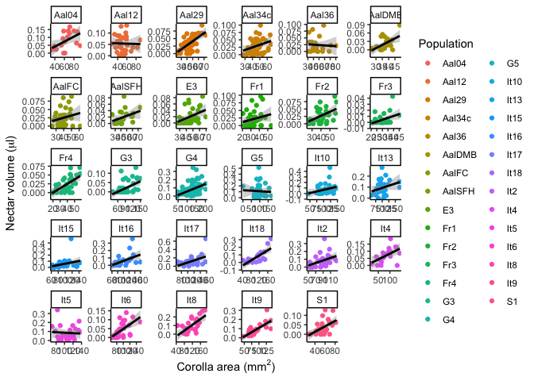

Analyses for honest signals MS
================

## Analyses

Question 1: Is flower size variation consistent between the field and
the greenhouse?

*Approach*: Comparing population means between the field and the
greenhouse. Are we trying to compare each individual population field to
greenhouse (e.g. two sample t-tests), or a trend across the populations
field vs. greenhouse (e.g. regression of population means between field
and greenhouse)?

Question 2: Are size and scent honest signals for nectar rewards?

*Approach*: Correlation between size and rewards, and between scent and
rewards. First do a regression of all plants, with plant nested within
population as a random effect. Then do regressions for each population.

Question 3: Are populations pollen limited? \[Q3\]

*Approach*: Paired t-tests comparing controlled vs. open pollinated seed
set in each population.

### Packages and start up code:

``` r
library(tidyverse)
library(readxl)
library(lme4)
library(lmerTest)
library(knitr)
```

### Q2: Are size and scent honest signals for nectar rewards?

Loading in the data

``` r
nectar <- read_excel("nectar protocol.xlsx")
```

#### Summarizing and subsetting the dataset

*summarizing the NAs*

``` r
kable(nectar %>% filter(is.na(Population)) %>% group_by(Plant_id) %>% summarise(N=length(unique(flower_id))))
```

| Plant\_id |   N |
|----------:|----:|
|        91 |   3 |
|       104 |   3 |
|       121 |   3 |
|       182 |   3 |
|       190 |   3 |
|       201 |   3 |
|       206 |   3 |
|       211 |   3 |
|       237 |   3 |
|       259 |   3 |
|       274 |   3 |
|       275 |   3 |
|       296 |   3 |
|       297 |   3 |
|        NA |   6 |

*removing flowers where we don’t have the population and we don’t have
nectar and/or flower size*

``` r
nectar_work <- nectar %>% filter(!is.na(Population)) %>%  filter(!is.na(nectar_μl)) %>% filter(!is.na(Corola_area_mm2))
```

*summarizing how many flowers and plants we have data for*

``` r
nectar_work_sum <- nectar_work %>% group_by(Population) %>%  summarise(N_plants=length(unique(Plant_id)), N_flowers=length(flower_id))
kable(nectar_work_sum)
```

| Population | N\_plants | N\_flowers |
|:-----------|----------:|-----------:|
| Aal04      |         8 |         18 |
| Aal12      |        11 |         31 |
| Aal29      |        13 |         42 |
| Aal34c     |        15 |         43 |
| Aal36      |         8 |         23 |
| AalDMA     |         1 |          3 |
| AalDMB     |         8 |         23 |
| AalFC      |        11 |         35 |
| AalPB      |         5 |         15 |
| AalSFH     |         8 |         22 |
| E3         |        11 |         33 |
| Fr1        |        13 |         39 |
| Fr2        |        11 |         29 |
| Fr3        |        12 |         33 |
| Fr4        |        11 |         32 |
| G1         |         3 |          9 |
| G3         |        16 |         50 |
| G4         |        33 |         92 |
| G5         |        13 |         36 |
| G6         |         4 |         12 |
| G7         |         3 |          8 |
| G8         |         1 |          3 |
| G9         |         2 |          4 |
| It10       |        13 |         38 |
| It13       |         9 |         27 |
| It15       |        11 |         33 |
| It16       |        11 |         27 |
| It17       |        10 |         30 |
| It18       |         9 |         22 |
| It2        |        12 |         35 |
| It4        |         9 |         20 |
| It5        |        10 |         26 |
| It6        |        11 |         32 |
| It8        |        10 |         27 |
| It9        |        10 |         27 |
| S1         |        15 |         33 |

*making a list of populations with 8 or more plants sampled*

``` r
nectar_list <- nectar_work_sum %>% filter(N_plants >= 8)
```

*filtering the dataset to only contain those populations*

``` r
nectar_work8 <- nectar_work %>% group_by(Population) %>% filter (length(unique(Plant_id))>=8)
```

### Analysis: nectar vs. size, all populations

``` r
nectar_model<-lmer(nectar_μl~Corola_area_mm2+(1|Population/Plant_id), data=nectar_work8)

par(mfrow=c(1,2))
hist(resid(nectar_model))
plot(predict(nectar_model),resid(nectar_model)) ; abline(h=0)
```

<!-- --> The
residuals get a little better with a square-root transformation, but
it’s not a huge difference.

``` r
ggplot(aes(x=Corola_area_mm2, y=nectar_μl), data=nectar_work8)+geom_point(aes(color=Population))+geom_smooth(method="lm",color="black")+theme_classic()+xlab(expression(paste("Corolla area (", mm^2 ,")"))) + ylab(expression(paste("Nectar volume (", mu,"l)")))
```

    ## `geom_smooth()` using formula 'y ~ x'

<!-- --> I
think this works for now, but if we use all of this data, it’s probably
not effective to show this many populations in colors. Maybe we don’t
need to color the points by population here if we do a population by
population analysis. Another option could be coloring the points by
mating system, or region.

## Analysis: nectar vs. size, population by population

``` r
ggplot(aes(x=Corola_area_mm2, y=nectar_μl, color=Population), data=nectar_work8)+geom_point()+
  facet_wrap(~Population, scales="free")+geom_smooth(method="lm", color="black")+theme_classic()+xlab(expression(paste("Corolla area (", mm^2 ,")"))) + ylab(expression(paste("Nectar volume (", mu,"l)")))
```

<!-- -->

``` r
f <- function(df) summary(lmer(nectar_μl ~ Corola_area_mm2 +(1|Plant_id), data = df))

v <- lapply(split(nectar_work8, nectar_work8$Population), f)

Pop=sort(as.factor(c(unique(nectar_work8$Population),unique(nectar_work8$Population))))

results<-data.frame("Estimate"=numeric(), "Std. Error"=numeric(), "df"=numeric(), "t value"=numeric(), "Pr(>|t|)"=numeric())


for (i in 1:29){
  z<-as.data.frame(v[[i]]$coefficients)
  results<-rbind(results,z)
}

results<-cbind(results, Pop)


results<-results %>% tibble::rownames_to_column() 
results <- results %>% filter(str_detect(rowname, "Corola")) %>% select(-rowname) %>% relocate(Pop) %>% mutate(Sig=if_else(`Pr(>|t|)`< 0.05, "Yes", "No")) 
kable(results)
```

| Pop    |   Estimate | Std. Error |        df |    t value | Pr(&gt;\|t\|) | Sig |
|:-------|-----------:|-----------:|----------:|-----------:|--------------:|:----|
| Aal04  |  0.0013040 |  0.0006967 | 15.881577 |  1.8717772 |     0.0797726 | No  |
| Aal12  |  0.0011256 |  0.0005457 | 28.989376 |  2.0626750 |     0.0482040 | Yes |
| Aal29  |  0.0014136 |  0.0002887 | 27.294673 |  4.8964210 |     0.0000392 | Yes |
| Aal34c |  0.0010282 |  0.0004307 | 35.858561 |  2.3871995 |     0.0223738 | Yes |
| Aal36  | -0.0001285 |  0.0004723 |  6.708009 | -0.2720635 |     0.7937559 | No  |
| AalDMB |  0.0021986 |  0.0006927 | 14.835149 |  3.1739284 |     0.0063630 | Yes |
| AalFC  |  0.0008291 |  0.0005083 | 32.523891 |  1.6311194 |     0.1125124 | No  |
| AalSFH |  0.0007254 |  0.0004025 | 12.128386 |  1.8024451 |     0.0963635 | No  |
| E3     |  0.0012568 |  0.0003398 | 30.475240 |  3.6982758 |     0.0008540 | Yes |
| Fr1    |  0.0014803 |  0.0006345 | 23.956013 |  2.3332194 |     0.0283610 | Yes |
| Fr2    |  0.0016901 |  0.0005446 | 23.384906 |  3.1035910 |     0.0049416 | Yes |
| Fr3    |  0.0006278 |  0.0002663 | 31.000000 |  2.3577303 |     0.0248775 | Yes |
| Fr4    |  0.0012537 |  0.0003083 | 19.562775 |  4.0660135 |     0.0006263 | Yes |
| G3     |  0.0006918 |  0.0001763 | 41.112670 |  3.9243248 |     0.0003240 | Yes |
| G4     |  0.0010025 |  0.0002107 | 89.308662 |  4.7578305 |     0.0000075 | Yes |
| G5     |  0.0000516 |  0.0005600 | 31.945869 |  0.0921136 |     0.9271830 | No  |
| It10   |  0.0014202 |  0.0005085 | 30.629420 |  2.7930009 |     0.0089190 | Yes |
| It13   |  0.0007681 |  0.0005410 | 23.747470 |  1.4197427 |     0.1686777 | No  |
| It15   |  0.0014179 |  0.0006498 | 29.592631 |  2.1819766 |     0.0371899 | Yes |
| It16   |  0.0015897 |  0.0005504 | 24.999998 |  2.8883078 |     0.0078836 | Yes |
| It17   |  0.0024936 |  0.0008308 | 28.000000 |  3.0012543 |     0.0056000 | Yes |
| It18   |  0.0013445 |  0.0002853 | 18.068962 |  4.7130481 |     0.0001718 | Yes |
| It2    |  0.0017286 |  0.0006156 | 30.465859 |  2.8078521 |     0.0086212 | Yes |
| It4    |  0.0008047 |  0.0003032 | 18.000000 |  2.6545406 |     0.0161333 | Yes |
| It5    | -0.0000534 |  0.0008654 | 23.818748 | -0.0617506 |     0.9512767 | No  |
| It6    |  0.0013939 |  0.0003363 | 16.792595 |  4.1454584 |     0.0006929 | Yes |
| It8    |  0.0018435 |  0.0003973 | 24.616943 |  4.6404598 |     0.0000979 | Yes |
| It9    |  0.0018697 |  0.0003466 | 25.000000 |  5.3942611 |     0.0000135 | Yes |
| S1     |  0.0014483 |  0.0004314 | 17.196609 |  3.3567465 |     0.0036941 | Yes |

## If we want to only use the MSC data

``` r
nectar_msc <- nectar_work %>% filter(Population=="G3"|Population=="G4"|Population=="G5"|
                                       Population=="It10"|Population=="It13"|Population=="It15"|
                                       Population=="It16"|Population=="It17"|Population=="It18"|
                                       Population=="It2"|Population=="It4"|Population=="It5"|
                                       Population=="It6"|Population=="It8"|Population=="It9")

nectar_model<-lmer(nectar_μl~Corola_area_mm2+(1|Population/Plant_id), data=nectar_msc)
ggplot(aes(x=Corola_area_mm2, y=nectar_μl), data=nectar_msc)+geom_point(aes(x=Corola_area_mm2, y=nectar_μl, color=Population))+geom_smooth(method="lm")+theme_classic()+xlab(expression(paste("Corolla area (", mm^2 ,")"))) + ylab(expression(paste("Nectar volume (", mu,"l)")))
```

    ## `geom_smooth()` using formula 'y ~ x'

<!-- -->
