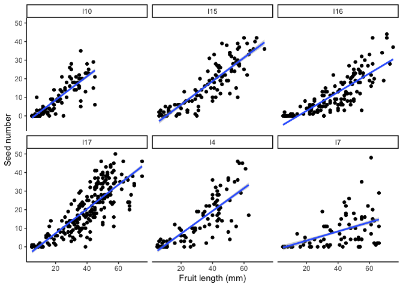

Seed estimates
================

## Purpose

In this document, I will create the regressions to estimate seed set in
the fruits that were open in Italy.

``` r
library(tidyverse)
library(readxl)
library(knitr)
library(lme4)
library(lmerTest)
library(knitr)
library(emmeans)
library(ggpubr)
library(plotrix)
library(magicfor)
```

``` r
seeds_E <- read_excel("Seed_estimate.xlsx")


seeds_E <- seeds_E %>% filter(!is.na(Missing_seeds)) %>% filter(!is.na(Treatment))

seeds_I <- seeds_E %>% filter(!str_detect(Population,"^G")) 
seeds_G <- seeds_E %>% filter(str_detect(Population,"^G")) 
```

The number of non HP and C fruits used in each population for the
regressions

``` r
kable(seeds_I %>% filter(Treatment != "c" & Treatment != "hp" & fruit_length >= 5) %>% group_by(Population, Treatment) %>% summarize(N=length(Missing_seeds)))
```

| Population | Treatment |   N |
|:-----------|:----------|----:|
| I10        | e         |  46 |
| I10        | n         |  65 |
| I15        | n         |  76 |
| I17        | n         | 111 |
| I7         | n         |  34 |
| Ι16        | n         |  82 |
| Ι4         | n         |  76 |

The percentages of fruits (from the control or hp treatments) that were
missing seeds

``` r
seeds_I %>% filter(Treatment == "c" | Treatment == "hp")  %>%  group_by(Population) %>% summarize(N_missing=sum(Missing_seeds), N_total=length(Missing_seeds)) %>% mutate(Per_missing=100*(N_missing/N_total))
```

    ## # A tibble: 6 x 4
    ##   Population N_missing N_total Per_missing
    ##   <chr>          <dbl>   <int>       <dbl>
    ## 1 I10               63     147        42.9
    ## 2 I15               97     189        51.3
    ## 3 I17               60     238        25.2
    ## 4 I7                 8      69        11.6
    ## 5 Ι16              110     192        57.3
    ## 6 Ι4                69     158        43.7

The number of fruits (broken out by treatments) that were intact

``` r
kable(seeds_I %>% filter(Treatment == "c" | Treatment == "hp" & fruit_length >= 5)  %>% group_by(Population, Treatment) %>% summarize(N_intact=length(Missing_seeds)-sum(Missing_seeds)))
```

| Population | Treatment | N\_intact |
|:-----------|:----------|----------:|
| I10        | c         |        46 |
| I10        | hp        |        24 |
| I15        | c         |        50 |
| I15        | hp        |        30 |
| I17        | c         |        90 |
| I17        | hp        |        68 |
| I7         | c         |        32 |
| I7         | hp        |        21 |
| Ι16        | c         |        42 |
| Ι16        | hp        |        35 |
| Ι4         | c         |        51 |
| Ι4         | hp        |        28 |

Okay so for a given population, we want to take the intact fruits where
fruit length was measured and was greater than or equal to 5, and run a
regression of fruit length vs. seed set with plant ID as a random effect

``` r
seeds_est <- seeds_I %>% filter(Missing_seeds==0 & fruit_length >= 5 & Seeds_counted!="NA")

f <- function(df) summary(lmer(Seeds_counted ~ fruit_length +(1|Plant_ID), data = df))

v <- lapply(split(seeds_est, seeds_est$Population), f)

Pop=sort(as.factor(c(unique(seeds_est$Population),unique(seeds_est$Population))))

results<-data.frame("Estimate"=numeric(), "Std. Error"=numeric(), "df"=numeric(), "t value"=numeric(), "Pr(>|t|)"=numeric())


for (i in 1:6){
  z<-as.data.frame(v[[i]]$coefficients)
  results<-rbind(results,z)
}

results<-cbind(results, Pop)

results<-results %>% tibble::rownames_to_column("Coefficient") 

kable(results)
```

| Coefficient    |   Estimate | Std. Error |        df |    t value | Pr(&gt;\|t\|) | Pop |
|:---------------|-----------:|-----------:|----------:|-----------:|--------------:|:----|
| (Intercept)    | -4.9030311 |  1.1720448 |  43.22923 | -4.1833136 |     0.0001380 | I10 |
| fruit\_length  |  0.6442419 |  0.0404219 |  99.05419 | 15.9379396 |     0.0000000 | I10 |
| (Intercept)1   | -6.9302873 |  1.4834267 |  78.21704 | -4.6718097 |     0.0000122 | I15 |
| fruit\_length1 |  0.6157679 |  0.0313306 | 104.38553 | 19.6538812 |     0.0000000 | I15 |
| (Intercept)2   | -6.1124375 |  1.4477199 | 106.46340 | -4.2221133 |     0.0000511 | I17 |
| fruit\_length2 |  0.6502955 |  0.0291129 | 220.91176 | 22.3370509 |     0.0000000 | I17 |
| (Intercept)3   | -1.5641300 |  2.3399232 |  49.25099 | -0.6684535 |     0.5069651 | I7  |
| fruit\_length3 |  0.2489382 |  0.0474980 |  68.80198 |  5.2410270 |     0.0000017 | I7  |
| (Intercept)4   | -7.0853665 |  1.2992793 |  99.90579 | -5.4533052 |     0.0000004 | Ι16 |
| fruit\_length4 |  0.4996711 |  0.0303692 | 130.38271 | 16.4532449 |     0.0000000 | Ι16 |
| (Intercept)5   | -5.2894699 |  1.6483733 |  63.25084 | -3.2089029 |     0.0020933 | Ι4  |
| fruit\_length5 |  0.6191814 |  0.0435775 |  92.51235 | 14.2087489 |     0.0000000 | Ι4  |

``` r
magic_for()
for (pop in unique(Pop)) {
  a <- seeds_I %>% filter(Population==pop) 
  aa <- results %>% filter(Pop==pop)
  b <- if_else(a$Missing_seeds==1, (a$fruit_length*aa[2,2])+aa[1,2], a$Seeds_counted)
  put(b)
}

z<-magic_result()
magic_free()
seeds_I$estimates<-unlist(z)
```

Here we are extracting the predicted values from each model fit, to use
in plotting

Figure of the regressions

``` r
pop_list <- unique(seeds_est$Population)

magic_for()
for (pop in pop_list) {
  a <- seeds_est %>% filter(Population==pop) 
  b <- lmer(Seeds_counted ~ fruit_length +(1|Plant_ID), data = a)
  c <- predict(b, type= "response")
  put(c)
  
}
z<-magic_result()
seeds_est$pred<-unlist(z)

ggplot(aes(x=fruit_length),data=seeds_est)+geom_point(aes(y=Seeds_counted)) + geom_smooth(aes(y=pred), method="lm")+facet_wrap(~Population)+theme_classic()+xlab("Fruit length (mm)")+ylab("Seed number")
```

<!-- -->

Now we need to take the `seeds_I$estimates` and put them into `seeds_E`,
to use for our calculations for pollen limitation for all populations

``` r
seeds_G$estimates <- seeds_G$Seeds_counted
seeds_work <- rbind(seeds_G, seeds_I)
```

``` r
seeds_work <- seeds_work %>% filter(Treatment == "hp" | Treatment == "c")

#looking at number of plants that had zeros in the hp fruits, to see if we really need to drop plants 
zees<-seeds_work %>% group_by(Population, Plant_ID) %>% filter(Treatment== "hp") %>% summarize(zeros=sum(estimates==0), nonzeroes=sum(estimates!=0))

zees2<-seeds_work %>% group_by(Population, Plant_ID, Treatment) %>%  summarize(zeros=sum(estimates==0), nonzeroes=sum(estimates!=0)) %>% pivot_wider(names_from=Treatment, values_from=c(zeros, nonzeroes))


#for now, we will only analyze plants where there were fewer than 2 zero-seed hand-pollinated fruits, following Sotiria's criteria
keep_list <- zees2 %>% filter(zeros_hp <2) %>% mutate(ID=paste(Population, Plant_ID))

seeds_work2<- seeds_work %>% mutate(ID=paste(Population, Plant_ID)) %>% filter(ID %in% keep_list$ID) %>% mutate(Treatment=factor(Treatment, levels=c("hp", "c")))

seeds_work2 %>% group_by(Population) %>% summarize(N=length(unique(Plant_ID)))
```

    ## # A tibble: 12 x 2
    ##    Population     N
    ##    <chr>      <int>
    ##  1 G1            22
    ##  2 G3            13
    ##  3 G6            28
    ##  4 G7            17
    ##  5 G8            23
    ##  6 G9            12
    ##  7 I10           16
    ##  8 I15           20
    ##  9 I17           19
    ## 10 I7            11
    ## 11 Ι16           20
    ## 12 Ι4            23

Run an lmer for each population

``` r
f <- function(df) as.data.frame(emmeans(lmer(estimates ~ Treatment +(1|Plant_ID), data = df), "Treatment"))

v <- lapply(split(seeds_work2, seeds_work2$Population), f)


f2 <- function(df) as.data.frame(pairs(emmeans(lmer(estimates ~ Treatment +(1|Plant_ID), data = df), "Treatment")))

v3 <- lapply(split(seeds_work2, seeds_work2$Population), f2)

v4 <-do.call(rbind.data.frame, v3)
v4$Pop<-rownames(v4)
rownames(v4)<-c()
v4$sig<-ifelse(v4$p.value<0.05, "*", "")

v2<-do.call(rbind.data.frame, v)

Pop=sort(as.factor(c(unique(seeds_work2$Population),unique(seeds_work2$Population))))


v2<-data.frame(v2, Pop, row.names = c())

kable(v2)
```

| Treatment |    emmean |       SE |       df |  lower.CL | upper.CL | Pop |
|:----------|----------:|---------:|---------:|----------:|---------:|:----|
| hp        | 14.942885 | 1.818878 | 31.04051 | 11.233455 | 18.65231 | G1  |
| c         | 12.582700 | 1.808288 | 30.41375 |  8.891789 | 16.27361 | G1  |
| hp        | 15.589550 | 1.894391 | 19.93256 | 11.637063 | 19.54204 | G3  |
| c         | 12.138835 | 1.923416 | 20.67681 |  8.135063 | 16.14261 | G3  |
| hp        | 25.100876 | 2.605697 | 52.64807 | 19.873694 | 30.32806 | G6  |
| c         | 15.420692 | 2.642681 | 55.30285 | 10.125293 | 20.71609 | G6  |
| hp        | 16.800679 | 2.269341 | 19.96026 | 12.066313 | 21.53504 | G7  |
| c         | 13.782001 | 2.268339 | 19.90233 |  9.048841 | 18.51516 | G7  |
| hp        | 11.975090 | 1.612601 | 44.60462 |  8.726350 | 15.22383 | G8  |
| c         |  7.993084 | 1.609851 | 44.34126 |  4.749348 | 11.23682 | G8  |
| hp        | 16.849021 | 1.944671 | 20.03896 | 12.793014 | 20.90503 | G9  |
| c         |  6.423405 | 2.005466 | 22.50001 |  2.269675 | 10.57714 | G9  |
| hp        | 12.193909 | 1.380126 | 22.04706 |  9.332057 | 15.05576 | I10 |
| c         |  8.088747 | 1.413334 | 23.59607 |  5.169123 | 11.00837 | I10 |
| hp        | 17.655894 | 1.692663 | 31.38009 | 14.205379 | 21.10641 | I15 |
| c         | 17.398525 | 1.716569 | 32.64015 | 13.904675 | 20.89237 | I15 |
| hp        | 16.063181 | 1.293816 | 41.45224 | 13.451131 | 18.67523 | I17 |
| c         | 14.624374 | 1.256285 | 38.46539 | 12.082169 | 17.16658 | I17 |
| hp        | 19.215916 | 2.339628 | 16.33440 | 14.264367 | 24.16747 | I7  |
| c         | 15.042725 | 2.430397 | 18.54478 |  9.947380 | 20.13807 | I7  |
| hp        | 18.737249 | 1.828748 | 31.08346 | 15.007899 | 22.46660 | Ι16 |
| c         | 15.579658 | 1.815678 | 30.68517 | 11.875018 | 19.28430 | Ι16 |
| hp        | 18.264904 | 1.724183 | 41.41548 | 14.783906 | 21.74590 | Ι4  |
| c         | 16.631915 | 1.659748 | 37.41123 | 13.270194 | 19.99364 | Ι4  |

``` r
kable(v4)
```

| contrast |   estimate |       SE |        df |   t.ratio |   p.value | Pop | sig |
|:---------|-----------:|---------:|----------:|----------:|----------:|:----|:----|
| hp - c   |  2.3601842 | 1.535166 | 139.53757 | 1.5374132 | 0.1264567 | G1  |     |
| hp - c   |  3.4507147 | 1.872154 |  90.81113 | 1.8431784 | 0.0685650 | G3  |     |
| hp - c   |  9.6801833 | 2.908255 | 201.41342 | 3.3285192 | 0.0010380 | G6  | \*  |
| hp - c   |  3.0186775 | 1.489123 | 115.18440 | 2.0271511 | 0.0449557 | G7  | \*  |
| hp - c   |  3.9820058 | 1.905295 | 101.62443 | 2.0899680 | 0.0391169 | G8  | \*  |
| hp - c   | 10.4256158 | 2.140999 |  82.56524 | 4.8695094 | 0.0000053 | G9  | \*  |
| hp - c   |  4.1051624 | 1.258279 |  96.41874 | 3.2625218 | 0.0015279 | I10 | \*  |
| hp - c   |  0.2573692 | 1.687109 | 132.20280 | 0.1525504 | 0.8789854 | I15 |     |
| hp - c   |  1.4388075 | 1.498557 | 152.84923 | 0.9601285 | 0.3385069 | I17 |     |
| hp - c   |  4.1731913 | 2.437366 |  48.82050 | 1.7121724 | 0.0932109 | I7  |     |
| hp - c   |  3.1575907 | 1.729255 | 136.99354 | 1.8259835 | 0.0700303 | Ι16 |     |
| hp - c   |  1.6329890 | 1.791575 | 119.98503 | 0.9114824 | 0.3638689 | Ι4  |     |

``` r
ggplot(aes(x=Treatment, y=emmean), data=v2) + facet_wrap(~Pop) +geom_point()+geom_errorbar(aes(ymin=emmean-SE, ymax=emmean+SE), width=0.2) +ylab("Estimated marginal mean") + theme_classic()+geom_text(aes(x=1.5, y=20, label=sig),data=v4, size=6 )
```

<!-- -->
